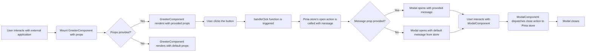

# Vue Greeter Component

## Overview

This project provides a reusable Vue.js component called `GreeterComponent` that displays a button and opens a modal with a customizable message. It utilizes Pinia for state management and can be easily integrated into other Vue.js projects.

## Application Flow

The following diagram illustrates the application flow using Mermaid:



## Key Components

*   **`GreeterComponent.vue`**: The main component that renders a button and triggers the modal.
*   **`ModalComponent.vue`**: A reusable modal component that displays a message.
*   **`src/stores/modalStore.ts`**: Pinia store for managing the modal's state (visibility, message, and open count).
*   **`src/stores/greeterStore.ts`**: Pinia store for persisting Greeter component's props to local storage.

## Using the Component

This project provides a pre-built IIFE (Immediately Invoked Function Expression) bundle that can be directly included in an HTML file without requiring a build process in the consuming project.

1.  **Include the Bundle in Your HTML:**

    Add the following `<script>` tag to your HTML file, replacing the `src` attribute with the actual URL of the IIFE bundle:

    ```html
    <!DOCTYPE html>
    <html>
    <head>
      <title>Greeter Component Demo</title>
    </head>
    <body>

      <div id="app">
        <!-- Target element for the Greeter component -->
        <div id="greeter-container"></div>
      </div>

      <script src="https://vue-embeddable-component-wawansoers-projects.vercel.app/greeter-component.iife.js"></script>
      <script>
        // Initialize the Greeter component
        window.Greeter.init('#greeter-container', {
          message: 'Hello from the external HTML!',
          buttonLabel: 'Say Hello',
          theme: 'primary'
        });
      </script>
    </body>
    </html>
    ```

3.  **Initialize the Component:**

    After including the script, you can initialize the `GreeterComponent` using the global `Greeter` object:

    ```javascript
    window.Greeter.init('#greeter-container', {
      message: 'Hello from the external HTML!',
      buttonLabel: 'Say Hello',
      theme: 'primary'
    });
    ```

    *   Replace `#greeter-container` with the appropriate selector for the element where you want to mount the component.
    *   Customize the `message`, `buttonLabel`, and `theme` props as needed.


## Theme Options

The `GreeterComponent` supports the following theme options, which affect the button's appearance:

*   `primary`:  A blue-themed button (default).
*   `secondary`: A gray-themed button.
*   `success`:  A green-themed button.
*   `danger`:   A red-themed button.

To use a specific theme, set the `theme` prop when initializing the component:

```javascript
window.Greeter.init('#greeter-container', {
  message: 'Hello from the external HTML!',
  buttonLabel: 'Say Hello',
  theme: 'success' // Use the success theme
});
```


## Local Development Setup

Follow these steps to ensure the component displays correctly during local development:

1. **Install Dependencies:**

    Run the following command in the project root to install all required dependencies:

    ```bash
    bun install
    ```

    This will install the packages listed in `package.json`.

2. **Build the Application:**

    Use the command below to build the project and generate the necessary files:

    ```bash
    bun run build
    ```

3. **Verify `index.html` Configuration:**

    Open `index.html` in your browser and check the following:

    * Ensure the `<script>` tag correctly references the IIFE bundle (`./dist/greeter-component.iife.js`).
    * Confirm that the `Greeter.init` function is called with the correct selector and props. For example:

      ```html
      <script src="./dist/greeter-component.iife.js"></script>
      <script>
         // Initialize the Greeter component
         window.Greeter.init('#greeter-container', {
            message: 'Hello from the external HTML!',
            buttonLabel: 'Say Hello',
            theme: 'primary'
         });
      </script>
      ```

## Testing

To run the unit tests:

```bash
bun run test:unit
```
